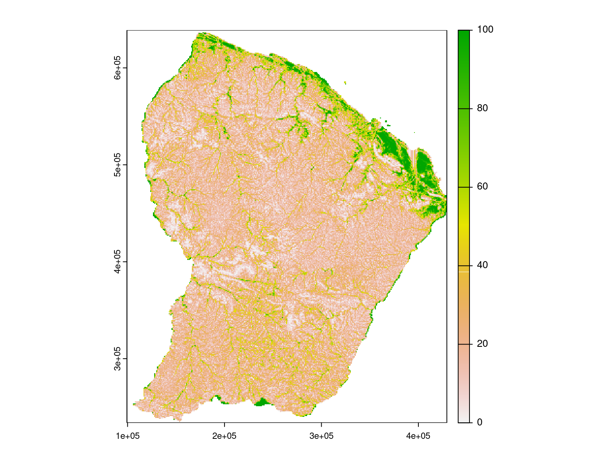
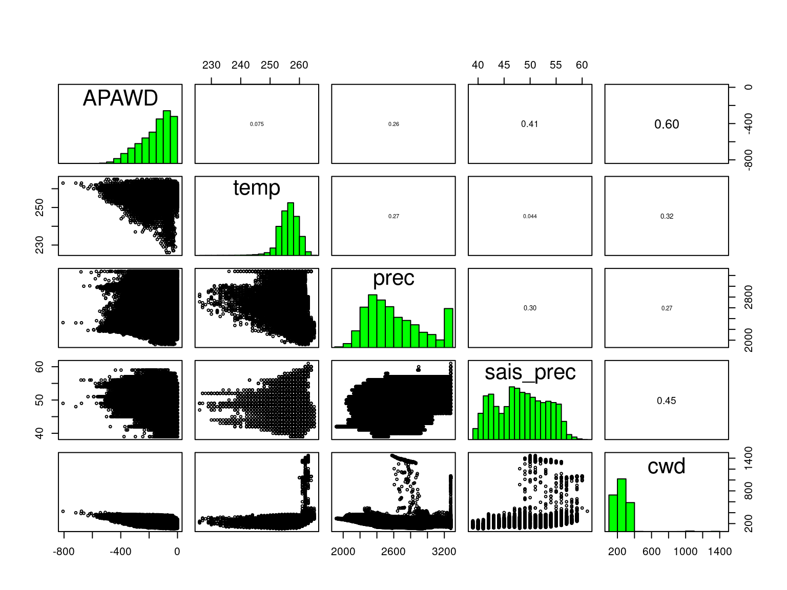
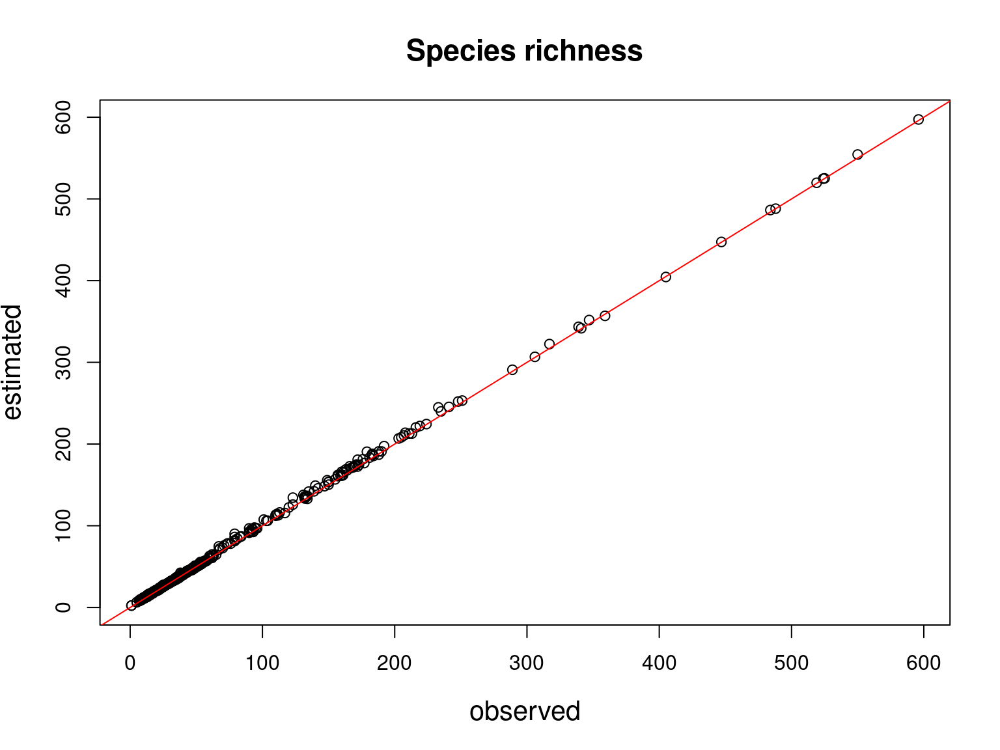
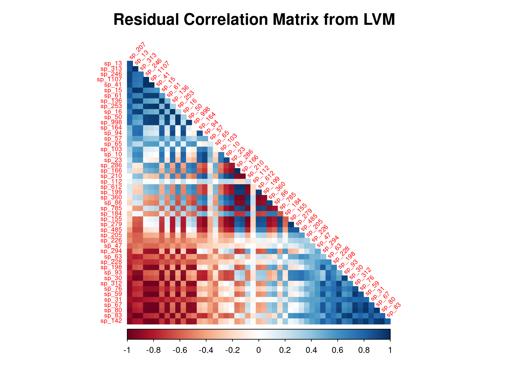

```{r setup, include=FALSE}
knitr::opts_chunk$set(
  fig.align="center",
  fig.width=8, fig.height=6,
  cache=TRUE,
  collapse=TRUE,
  comment="#>",
  highlight=TRUE,
  eval=FALSE
)
```

We want to fit JSDMS in French Guiana, one considering only bioclimatic variables, and the other one including species traits as additional explanatory variables. 

# Installation 

## jSDM R package

```{r install-jSDM, eval=FALSE}
# mail vendredi prévoir installer jSDM et gecevar
install.packages("jSDM")
# Rtools
```

## gecevar R package

```{r install-gecevar, eval=FALSE}
devtools::install_github("ghislainv/gecevar")
# grass, gdal, osmctools
```


# Load librairies

```{r load-librairies, echo=FALSE, eval=FALSE}
library(terra)
library(sf)
library(jSDM)
library(gecevar)
library(readr)
library(dplyr)
```

# Datasets


## Explanatory variables 

### Current environmental variables

#### Downloading

We use the function [`get_chelsa_current`](https://ecology.ghislainv.fr/gecevar/reference/get_chelsa_current.html) from the R package [`gecevar`](https://ecology.ghislainv.fr/gecevar) to download a set of climatic data for French Guiana from the website: \url{chelsa-climate.org}.  

```{r download-climate-data, eval=FALSE}
library(gecevar)
name <- "French Guiana"
#epsg <- 2972
epsg <- 32622
output_file <- "/home/clement/Documents/projet_METRADICA/data"
setwd("~/Documents/projet_METRADICA/data/")
# Get French Guiana extent in the specified coordinates system (EPSG)
output <- gecevar::transform_shp_country_extent(EPSG = epsg,
                                                country_name = name,
                                                rm_download = FALSE)
save(output,
     file="~/Documents/projet_METRADICA/data/output.RData")
extent <- output[[1]][1]
extent_latlon <- as.numeric(output[[1]][2:5])
clim_path <- get_chelsa_current(extent_latlon = extent_latlon,
                                extent = extent,
                                EPSG = epsg,
                                destination = output_file,
                                resolution = 1000,
                                rm_download = TRUE)
```

```{r clim-data-table, eval=TRUE, echo=FALSE}
library(kableExtra)
Variable <- c("Minimum monthly temperatures", "Maximum monthly temperatures",
              "Average monthly temperatures", "Monthly precipitation", "Cloud cover", 
              "Climatic water deficit (Thornthwaite)",
              "Potential evapotranspiration (Thornthwaite)", "Number of dry months (Thornthwaite)",
              "Climatic water deficit (Penman-Monteith)", "Potential evapotranspiration (Penman-Monteith)", 
              "Number of dry months (Penman-Monteith)", "Annual mean temperature (bio1 or temp)",
              "Diurnal temperature range (bio2)", "Isothermality (bio3=bio2/bio7)",
              "Seasonality of temperatures (bio4 or sais_temp)", 
              "Maximum temperature of the warmest month (bio5)",
              "Minimum temperature of the coldest month (bio6)",
              "Annual temperature range (bio7=bio5-bio6)",
              "Average temperature of the wettest quarter (bio8)",
              "Average temperature of the driest quarter (bio9)",
              "Average temperature of the warmest quarter (bio10)",
              "Average temperature of the coldest quarter (bio11)",
              "Cumulative annual precipitation (bio12 or prec)",
              "Cumulative precipitation of wettest month (bio13)",
              "Cumulative precipitation of the driest month (bio14)",
              "Seasonality of rainfall (bio15 or sais_prec)",
              "Precipitation in wettest quarter (bio16)",
              "Precipitation of driest quarter (bio17)",
              "Warmest quarter precipitation (bio18)",
              "Coldest quarter precipitation (bio19)")

Unit <- c(rep("°C x 10", 3),
          "$kg.m^{-2}.month^-1$", "\\%", "$kg.m^{-2}$", "$kg.m^{-2}.month^-1$", "months", 
          "$kg.m^{-2}$", "$kg.m^{-2}.month^-1$", "months", rep("°C x 10",11),
          "$kg.m^{-2}.year^{-1}$", "$kg.m^{-2}.month^{-1}$", "$kg.m^{-2}.month^{-1}$",
          "$kg.m^{-2}$", rep("$kg.m^{-2}.month^{-1}$", 4))

dataset <- data.frame(Variable, Unit)
colnames(dataset )<- c("Variable", "Unit")
knitr::kable(dataset, row.names=F, booktabs=TRUE, align = 'l', escape=FALSE, 
             caption="Climate data downloaded from https://chelsa-climate.org/") %>%
  kableExtra::kable_styling(latex_options=c("HOLD_position","striped"), full_width=FALSE)
```

#### Formatting

Among the climatic data downloaded, concerning the whole French Guiana territory at present (interpolations of representative observed data from the years 1960-1990).
We choose to use the following variables because they have an ecological meaning which makes them easily interpretable and are little correlated between them according to the article @Vieilledent2013 : 

- **temp**: the average annual temperature ($^\circ C\times 10$).
- **prec**: the average annual precipitation (mm).
- **sais_temp**: the seasonality of temperatures corresponds to the standard deviation of monthly temperatures multiplied by $100$.
- **sais_prec**: the seasonality of precipitation as a coefficient of variation.
- **cwd**: the annual climatic water deficit (mm) is based on monthly precipitation ($prec$) and potential evapotranspiration ($pet$) which is defined as the amount of evaporation that would occur in a month if a sufficient water source were available: $\mathrm{cwd}= \sum_{m=1}^{12}\min(0, \ \mathrm{prec}_m-\ \mathrm{pet}_m)$.

We consider also the quadratic effects of these climate variables to perform a quadratic regression, which is more suitable for fitting a niche model than a linear regression. 

```{r current-environmental-variables,}
clim_path <- "~/Documents/projet_METRADICA/data/data_raw/current_chelsa.tif"
load("~/Documents/projet_METRADICA/data/output.RData")
# get interesting covariates among the climatic variables downloaded  
clim_var <- terra::rast(clim_path,
                        lyrs=c("bio1", "bio4", "bio12", "bio15", "cwd_penman"))
names(clim_var) <- c("temp", "sais_temp", "prec", "sais_prec", "cwd")
proj <- terra::crs(clim_var)

# Data restricted to French Guiana's borders
borders <- terra::vect(output[[2]], layer="gadm36_GUF_0")
borders <- terra::project(borders, proj)
clim_var <- terra::mask(clim_var, borders)
# representation
par(oma=c(0,0,2,1))
terra::plot(clim_var, legend=TRUE)
title("Current bioclimatic variables", outer=TRUE, cex=0.8)
```


```{r current-environmental-variables2, echo=FALSE, out.width=800, eval=TRUE}

```

### Water stress index 

#### Percentage of seasonally flooded forest

```{r percentage-BF}

# hd1 <- terra::rast("~/Documents/projet_METRADICA/data/Environment/hd1.tif")
# hd2 <- terra::rast("~/Documents/projet_METRADICA/data/Environment/hd2.tif")
# # Continuous to binary values (1 BF/ 0 not BF)
# BF <- (hd1 < 2)
# Change the resolution from 30m to 1km by summing values of 30m cells inside each 1km cell
# # This function works but the resolution of the output is not exactly 1000x1000
# BF_1.018km <- terra::aggregate(BF, fact=ceiling(1000/terra::res(BF)), fun="sum", na.rm=TRUE)
# # Number of 30.87103m cells inside each 1.018km cell 
# fact <- terra::res(BF_1.018km)/terra::res(BF)
# n <-  fact[1] * fact[2]
# # Percentage of BF 30.87103m cells inside each 1.018km cell 
# percent_BF_1.018km <- (BF_1.018km/n)*100 
# test <- terra::project(x=BF_1.018km, y=terra::crs(BF), res=c(1000,1000), method="sum")

# Binary values (1 BF/ 0 not BF)
BF <-  terra::rast("~/Documents/projet_METRADICA/data/Environment/BasFond_ONF_hand2/BF_hand2.img")
# Crop to French Guiana border
load("~/Documents/projet_METRADICA/data/output.RData")
FG_borders <- terra::vect(output[[2]], layer="gadm36_GUF_0")
# Projection from lat long to UTM 22N
FG_borders <- terra::project(FG_borders, terra::crs(BF))
## Crop to French Guiana border
BF <- terra::mask(BF, FG_borders)
# This function give an output with exactly 1000x1000 resolution 
BF_1km <- terra::project(x=BF, y=terra::crs(BF), res=c(1000,1000), method="sum")
## Lands pixels
land <- !is.na(BF)
## Sum of land pixels in 1km
land_sum1km <- terra::project(x=land, y=terra::crs(land), res=c(1000,1000), method="sum")
## Replace zero by NA values in land at 1km
land_sum1km_nozeros <- terra::mask(land_sum1km, FG_borders)
terra::writeRaster(land_sum1km_nozeros,
                   "~/Documents/projet_METRADICA/JSDM_French_Guiana/JSDM_French_Guiana_cache/land_sum1km_nozeros.tif",
                   gdal=c("COMPRESS=LZW", "PREDICTOR=2"), overwrite=TRUE)
# Percentage of BF 30.87103m cells inside each 1km cell 
percent_BF_1km <- (BF_1km/land_sum1km_nozeros)*100 
terra::plot(percent_BF_1km)
```

```{r plot-percent-BF, echo=FALSE, out.width=800, eval=TRUE}

```

#### Water stress index computation 

```{r SH-1km}
clim_path <- "/home/clement/Documents/projet_METRADICA/data/data_raw/current_chelsa.tif"
# Climatic water deficit (from Chelsa using pet_penman)
cwd <- terra::rast(clim_path, lyrs="cwd_penman")
percent_BF_1km_crop <- terra::resample(percent_BF_1km,cwd)
# Water stress index
SH_1km <- cwd*(1/(1+percent_BF_1km_crop))
terra::plot(SH_1km, range=c(0,150))
```

```{r plot-SH, echo=FALSE, out.width=800, eval=TRUE}

```

### Geologie 

```{r geol-1km}
geol <- terra::rast("~/Documents/projet_METRADICA/data/Environment/Geologie/gos.tif")
class <- unique(terra::values(geol, mat=FALSE, na.rm=TRUE))
geol_1 <- geol == class[1]
land_sum1km_nozeros <- terra::rast("~/Documents/projet_METRADICA/JSDM_French_Guiana/JSDM_French_Guiana_cache/land_sum1km_nozeros.tif")
geol_1km <- terra::project(x=geol_1, y=terra::crs(land_sum1km_nozeros),
                           res=c(1000,1000), method="sum")
# Percentage of each soil type inside each 1km cell 
land_sum1km_nozeros_crop <- terra::resample(land_sum1km_nozeros, geol_1km)
percent_geol_1km <- (geol_1km/land_sum1km_nozeros_crop)*100 
for(l in 2:length(class)){
  geol_l <- geol == class[l]
  geol_1km <- terra::project(x=geol_l, y=terra::crs(land_sum1km_nozeros),
                             res=c(1000,1000), method="sum")
  percent_geol_1km <- c(percent_geol_1km, (geol_1km/land_sum1km_nozeros_crop)*100)
}
terra::plot(percent_geol_1km)
```

```{r plot-percent-geol, echo=FALSE, out.width=800, eval=TRUE}

```

### Geomorphologie

```{r geomorpho-1km}
GM <- terra::rast("~/Documents/projet_METRADICA/data/Environment/PaysagesGeomorphoGuyane/GM_30m.tif")
class <- unique(terra::values(GM, mat=FALSE, na.rm=TRUE))
GM_1 <- GM == class[1]
GM_1km <- terra::project(x=GM_1, y=terra::crs(GM),
                         res=c(1000,1000), method="sum")
# Percentage of each soil type inside each 1km cell 
land_sum1km_nozeros_crop <- terra::resample(land_sum1km_nozeros, GM_1km)
percent_GM_1km <- (GM_1km/land_sum1km_nozeros_crop)*100 
for(l in 2:length(class)){
  GM_l <- GM == class[l]
  GM_1km <- terra::project(x=GM_l, y=terra::crs(GM), 
                           res=c(1000,1000), method="sum")
  percent_GM_1km <- c(percent_GM_1km, (GM_1km/land_sum1km_nozeros_crop)*100)
}
terra::plot(percent_GM_1km)
```

```{r plot-percent-geomorpho, echo=FALSE, out.width=800, eval=TRUE}

```

### Available Plant water deficit (APAWD)

```{r APAWD-1km}
APAWD <- terra::rast("/home/clement/Documents/projet_METRADICA/data/apawd12m2.tif")
terra::plot(APAWD, main="APAWD")
```

```{r plot-APAWD, echo=FALSE, out.width=800, eval=TRUE}

```


## Resonse variable: Forest inventory 

Forest inventories carried out in French Guiana, in the context of Guyafor, Guyadiv, Habitat,  Diadema, AmaLin and Paracou project are available.
We use these forest inventories to calculate a matrix indicating the presence by a $1$ and the absence by a $0$ of the species at each site by removing observations for which the species is not identified and rare species with less than 5 observations on all sites. This matrix therefore records the occurrences of $290$ species at $36$ sites.

### Gather and clean data-sets

```{r forest-inventory, eval=FALSE}
library(readr)
library(dplyr)
# Guyafor
f <- "~/Documents/projet_METRADICA/data/Inventaires/202110_DonneesModeleMetradicaTout+Diam.csv"
df <- readr::read_delim(f, delim=",")
df$Lat <- NA
df$Lon <- NA 
df$Topo <- NA
## Coordinates for Habitat project subplots (considered as plots)
habitat_plots <- readr::read_delim("~/Documents/projet_METRADICA/data/Inventaires/habitat_plots.csv", delim=",")
colnames(habitat_plots) <- c("Project", "idPlot", "idSubPlot",
                             "UTMZone", "SourceCoord", "Topo",
                             "Forest", "Plot", "SubPlot", "Lon", "Lat")
habitat_plots$Project <- "Habitat"
# Missing coordinates for some plots of Habitat Project 
unique(df[is.na(df$Xutm)  & is.na(df$Lat), c("Plot", "Project")])  
# Missing in habitat_plots file too except one plot
unique(df$Plot[is.na(df$Xutm)  & is.na(df$Lat)])%in% habitat_plots$Plot
sum(!(habitat_plots$Plot %in% unique(df$Plot)))
plot_with_coord  <- unique(df$Plot[is.na(df$Xutm)])[unique(df$Plot[is.na(df$Xutm)]) %in% habitat_plots$Plot] 
habitat_plots <- habitat_plots[habitat_plots$Plot==plot_with_coord,]
subplot <- habitat_plots$idSubPlot
for(i in 1:length(subplot)){
df[df$idSubPlot==subplot[[i]], c("Lat","Lon","Topo")] <- habitat_plots[habitat_plots$idSubPlot==subplot[[i]],                                                                          c("Lat","Lon","Topo")]
}

# Remove plots without coordinates 
df <- df[!(is.na(df$Xutm)) | !(is.na(df$Lat)),]

# GuyaDiv
## Inventory
f2 <- "~/Documents/projet_METRADICA/data/Inventaires/20211203_GuyaDiv.csv"
df2 <- readr::read_delim(f2, delim=",")
df2$Taxon <- paste0(df2$Genus,"_",df2$Species)
# Delete species whose identification is uncertain
## BotaCertainty=2 :Undetermined botanical species (after attempt of identification by the botanist)
## BotaCertainty=3 : Temporary identification (the botanist is waiting for a confirmation 
## of the name by a specialist or a confrontation with herbarium samples)
## BotaCertainty=4 : Confirmed identification 
df2 <- df2[df2$BotaCertainty>2, ]
# Remove species with indeterminate genus 
df <- df[-grep("Indet", df$Taxon), ]
df2 <- df2[-grep("Indet", df2$Taxon), ]

# Regroup by species taxa not defined at species but subspecies level
# subsp. 
length(unique(df$Taxon))
length(unique(df2$Taxon))
df$Taxon <- sub("( subsp. )+[a-z]+", "", df$Taxon)
df2$Taxon <- sub("(_subsp.)+[a-z]+", "", df2$Taxon)
# var.
df$Taxon <- sub("( var. )+[a-z]+", "", df$Taxon)
df2$Taxon <- sub("(_var.)+[a-z]+", "", df2$Taxon)

# Type of inventory (Plein/Points)
f3 <- "~/Documents/projet_METRADICA/data/Inventaires/ParcellesGUYADIV_2021.csv"
df3 <- readr::read_delim(f3, delim=",")
# Correction of parcelle's names to match plot names in df2 
df3$Parcelle[!(df3$Parcelle %in% df2$Plot)]
unique(df2$Plot[!(df2$Plot  %in% df3$Parcelle)])
# Nouragues (Grand_Plateau)
df3$Parcelle[grep("NOU[1-9][1-9]L", df3$Parcelle,)] <-  unique(df2[(df2$Forest=="Nouragues") & !(df2$Plot  %in% df3$Parcelle), "Plot"])$Plot
  
# Paracou ("1"  "10" "11" "16" "2"  "3"  "4"  "5"  "6"  "7"  "9")
df3$Parcelle[grep("PAR", df3$Parcelle,)] <- unique(df2[(df2$Forest=="Paracou") & (df2$SubPlot=="1"), "Plot"])$Plot

# Paracou ("18(Guyaflux))
df3$Parcelle[grep("GF", df3$Parcelle,)] <- unique(df2[(df2$Forest=="Paracou") &(df2$SubPlot!="1"), "Plot"])$Plot

# Site expérimental ONF de Montagne Tortue ("P17_temoin")
df3$Parcelle[grep("TORT2", df3$Parcelle,)] <- unique(df2[(df2$Forest=="Montagne_Tortue") & !(df2$Plot  %in% df3$Parcelle), "Plot"])$Plot

# Check
df3$Parcelle[!(df3$Parcelle %in% df2$Plot)]
unique(df2$Plot[!(df2$Plot  %in% df3$Parcelle)])
nsp1 <- length(unique(df$Taxon))
nsp2 <- length(unique(df2$Taxon))
nsp_tot <- length(unique(c(df$Taxon,df2$Taxon)))
nsp_com <- sum((unique(df2$Taxon) %in% unique(df$Taxon)))


# Keep only exhaustive inventories
df3 <- df3[df3$Type=="Plein", ]
# Delete non-exhaustive inventories in df2 
df2 <- df2[df2$Plot %in% df3$Parcelle,]
df2$Project <- "GuyaDiv"
df2$UTMZone <- NA
df2 <- dplyr::select(df2, c('Forest','Plot','PlotArea','SubPlot','idTree','Xutm','Yutm','Lat','Lon','Taxon','Project','UTMZone'))
## Add coordinates 
coord_f2 <- "~/Documents/projet_METRADICA/data/Inventaires/20230310_GuyaDivCoord.csv"
coord_df2 <- readr::read_delim(coord_f2, delim=";")
coord_df2 <- unique(dplyr::select(coord_df2, c("Forest", "Plot", "XutmSO", "YutmSO", "LatSO", "LonSO", "UTMZone")))
names(coord_df2) <- c("Forest", "Plot", "Xutm", "Yutm", "Lat", "Lon", "UTMZone")
plot <- unique(df2$Plot)
for(i in 1:length(plot)){
df2[df2$Plot==plot[[i]], c( "Xutm", "Yutm", "Lat", "Lon", "UTMZone")] <- coord_df2[coord_df2$Plot==plot[[i]],                                                                           c("Xutm", "Yutm", "Lat", "Lon", "UTMZone")]
}

# forest inventory
trees <- rbind(df[, colnames(df)  %in% colnames(df2)], df2[, colnames(df2)  %in% colnames(df)])
trees[, c("PlotArea", "SourceCoord", "idPlot")] <- NA
trees[trees$Project=="GuyaDiv", "PlotArea"] <- df2[, "PlotArea"]
trees[trees$Project=="GuyaDiv", "SourceCoord"] <- "plot"
trees[!(trees$Project=="GuyaDiv"), c( "SourceCoord")] <- df[, c( "SourceCoord")]
# New column idPlot <- forest_plot (same IdPlot for different forest between projects)
trees$Forest <- gsub( " ", "_", trees$Forest)
trees$idPlot <- paste0(trees$Forest, "_" ,                           trees$Plot)
# # Add Habitat project's subplot coordinates
# trees$idPlot[!(trees$Project=="Habitat")] <- paste0(trees$Forest[!(trees$Project=="Habitat")], "_",                                         trees$Plot[!(trees$Project=="Habitat")])
# trees$idPlot[trees$Project=="Habitat"] <- paste0(trees$Forest[trees$Project=="Habitat"], "_",                                         trees$SubPlot[trees$Project=="Habitat"])

write.csv(unique(trees), file ="~/Documents/projet_METRADICA/data/Inventaires/trees.csv", row.names = FALSE)

# # Check coordinates plots Nouragues and Montagne tortue  (different plot or just different id ? between Guyadiv and Guyafor)
# # CriquePlomb/CriquePlombGuyaDiv OK, Regina/Regina_St_Georges OK 
# # Piton Armontabo OK
# plot(unique(trees[trees$Forest=="Piton_Armontabo", c(4,5)]), pch=19)
# points(unique(trees[trees$Forest=="PitonArmontabo", c(4,5)]), pch=19, col='red')
# 
# # Petite_Montagne_Tortue OK but 7 plots with same coordinates PMT1-PMT7 (GuyaDiv)
# unique(trees[trees$Forest=="Petite_Montagne_Tortue", -c(2,3,9,12,13,14)])
# plot(unique(trees[trees$Forest=="Petite_Montagne_Tortue" & trees$Project=="AmaLin", c(4,5)]), pch=19)
# points(unique(trees[trees$Forest=="Petite_Montagne_Tortue"  & trees$Project=="GuyaDiv", c(4,5)]), pch=19, col='red')
# 
# # Nouragues
# unique(trees[trees$Forest=="Nouragues", -c(2,3,9,12,13,14)])
# plot(unique(trees[trees$Forest=="Nouragues" & trees$Project=="Guyafor", c(4,5)]), pch=".", 
#      xlim=c(min(unique(trees[trees$Forest=="Nouragues", 4])),
#             max(unique(trees[trees$Forest=="Les_Nouragues", 4]), na.rm=TRUE)),
#           ylim=c(min(unique(trees[trees$Forest=="Nouragues", 5])),
#             max(unique(trees[trees$Forest=="Nouragues", 5]))))
# points(unique(trees[trees$Forest=="Nouragues" & trees$Project=="GuyaDiv", c(4,5)]), pch=19, col='red')
# points(unique(trees[trees$Forest=="Nouragues" & trees$Project=="AmaLin", c(4,5)]), pch=19, col='blue')
# points(unique(trees[trees$Forest=="Les_Nouragues", c(4,5)]), pch=19, col='green')
# # CSG
# plot(unique(trees[trees$Forest=="CSG", c(4,5)]), pch=19, 
#      xlim=c(min(unique(trees[trees$Forest=="CSG", 4])),
#             max(unique(trees[trees$Forest=="Centre_Spatial", 4]), na.rm=TRUE)),
#           ylim=c(min(unique(trees[trees$Forest=="Centre_Spatial", 5])),
#             max(unique(trees[trees$Forest=="Centre_Spatial", 5]))))
# points(unique(trees[trees$Forest=="Centre_Spatial", c(4,5)]), pch=19, col='red')
# # Trinite
# plot(unique(trees[trees$Forest=="Trinite", c(4,5)]), pch='*')
# points(unique(trees[trees$Forest=="TriniteGentry", c(4,5)]), pch=19, col='red')
# # Limonade
# plot(unique(trees[trees$Forest=="Limonade", c(4,5)]), pch='*')
# points(unique(trees[trees$Forest=="Saul_Diadema_(Limonade)", c(4,5)]), pch=19, col='red')
# # Paracou
#  plot(unique(trees[trees$Forest=="Paracou", c(4,5)]), pch='.')
#  points(unique(trees[trees$Forest=="Crique_Paracou", c(4,5)]), pch='*', col='red')

# Use date (df$FirstYear/ df$LastYear and df2$CensusYear)
# Compute growth (Guiadiv df2$Circ, Guyafor df$FirstDiam, df$LastDiam)

```


### Define new inventory plots with an area of 1km^2

```{r define-1km-inventory-sites} 
trees <- readr::read_delim(file="~/Documents/projet_METRADICA/data/Inventaires/trees.csv", delim=",", col_types = c("c","c","c","d","d","i","c","c","d","d","d","c","c"), show_col_types=TRUE)
xy_22 <- terra::vect(trees[trees$UTMZone==22, c("Xutm", "Yutm")],
                  geom=c("Xutm","Yutm"), crs="epsg:32622")
latlon_22 <- terra::project(xy_22, "epsg:4326")
xy_21 <- terra::vect(trees[trees$UTMZone==21, c("Xutm", "Yutm")],
                  geom=c("Xutm","Yutm"), crs="epsg:32621")
latlon_21 <- terra::project(xy_21, "epsg:4326")
trees[trees$UTMZone==21, c("Lon", "Lat")] <- terra::crds(latlon_21)
trees[trees$UTMZone==22, c("Lon", "Lat")] <- terra::crds(latlon_22)
# SpatRaster with 1km cells on French Guiana's borders
load("~/Documents/projet_METRADICA/data/output.RData")
borders <- terra::vect(output[[2]], layer="gadm36_GUF_0")
borders_m <- terra::project(borders, "epsg:32622")
rast_m <- terra::rast(borders_m, res=1000)
rast <- terra::project(rast_m, "epsg:4326")
# Attributes each observation to its inventory plot
trees$numCell <- terra::cellFromXY(rast, as.matrix(trees[ ,c("Lon", "Lat")]))
numCells <- unique(trees$numCell)
trees <- trees %>%
  group_by(numCell) %>%
  mutate(new_idPlot=as.character(cur_group_id()))
# Coordinates of cells or new inventory plots 
# Get coordinates of the center of raster cells 
trees$Lat_Plot <- terra::yFromCell(rast, trees$numCell) 
trees$Lon_Plot <- terra::xFromCell(rast, trees$numCell)
write.csv(trees, file ="~/Documents/projet_METRADICA/data/Inventaires/trees_coord.csv", row.names = FALSE)
```

### Presence-absence matrix

```{r PA-table, include=FALSE}
trees <- readr::read_delim(file="~/Documents/projet_METRADICA/data/Inventaires/trees_coord.csv", delim=",",
                           col_types = readr::cols(new_idPlot="c",
                                                   numCell="c"),
                           show_col_types=TRUE)
# presence/absence of each species on each plot
nplot <- length(unique(trees$new_idPlot))
species <- unique(trees$Taxon)
nsp <- length(species)
# presence/absence of each species on each plot
PA <- matrix(0, nplot, nsp)
rownames(PA) <- unique(trees$new_idPlot)
colnames(PA) <- unique(trees$Taxon)
  for (j in 1:nsp){
    idx <- which(trees$Taxon == species[j])
    PA[unique(trees$new_idPlot[idx]),j] <- 1 
}

# Remove very rare species 
rare_species <- which(colSums(PA)<=2)
trees <- trees[!(trees$Taxon %in% names(rare_species)),]
PA <- PA[ ,which(colSums(PA)>2)]
nsp <- ncol(PA)
nplot <- nrow(PA)
species <- colnames(PA)
write.csv(PA, file ="~/Documents/projet_METRADICA/data/Inventaires/PA.csv")
PA_anon <- PA
rownames(PA_anon) <- paste0("site_", 1:nplot)
colnames(PA_anon) <- paste0("sp_", 1:nsp)
write.csv(PA_anon, file ="~/Documents/projet_METRADICA/JSDM_French_Guiana/JSDM_French_Guiana_files/PA.csv")
knitr::kable(PA_anon[1:25,1:25], digits=1, booktabs=TRUE, align = 'c') %>%
  kableExtra::kable_styling(latex_options=c("HOLD_position","striped"), full_width=FALSE) %>% 
  kableExtra::save_kable(file="~/Documents/projet_METRADICA/JSDM_French_Guiana/JSDM_French_Guiana_files/PA_FG.png")
```

\cr 
\cr
```{r FG-PA, echo=FALSE, out.width=900, eval=TRUE}
knitr::include_graphics("JSDM_French_Guiana_files/PA_FG.png")
```

# Assessing correlations between explanatory variables  

```{r var-corr}
# Climatic variables
clim_path <- "~/Documents/projet_METRADICA/data/data_raw/current_chelsa.tif"
load("~/Documents/projet_METRADICA/data/output.RData")
# get interesting covariates among the climatic variables downloaded  
clim_var <- terra::rast(clim_path,
                        lyrs=c("bio1", "bio4", "bio12", "bio15", "cwd_penman"))
names(clim_var) <- c("temp", "sais_temp", "prec", "sais_prec", "cwd")
proj <- terra::crs(clim_var)

# Data restricted to French Guiana's borders
borders <- terra::vect(output[[2]], layer="gadm36_GUF_0")
borders <- terra::project(borders, proj)
clim_var <- terra::mask(clim_var, borders)
# APAWD
APAWD <- terra::rast("/home/clement/Documents/projet_METRADICA/data/apawd12m2.tif")
names(APAWD) <- "APAWD"
APAWD <- terra::project(APAWD, clim_var)
# pairwise correlation
terra::pairs(c(APAWD, clim_var), cor=TRUE,  use="pairwise.complete.obs", maxcells=200000, hist=TRUE)
```

```{r plot-var-corr, echo=FALSE, out.width=1000, eval=TRUE}

```

# Design matrix 

```{r design-matrix, echo=FALSE}
# Spatial points of each plot
trees <- readr::read_delim(file="~/Documents/projet_METRADICA/data/Inventaires/trees_coord.csv", delim=",",
                           col_types = cols(new_idPlot="c", numCell="c"),
                           show_col_types=TRUE)
plots_coords <- unique(dplyr::select(trees, c(new_idPlot, Lon_Plot, Lat_Plot)))
coords <- terra::vect(plots_coords, geom=c("Lon_Plot", "Lat_Plot"), crs="epsg:4326")

terra::writeVector(coords, overwrite=TRUE, "~/Documents/projet_METRADICA/JSDM_French_Guiana/JSDM_French_Guiana_cache/coords.shp")
remove(trees)
# Climatic variables 
clim_path <- "~/Documents/projet_METRADICA/data/data_raw/current_chelsa.tif"
load("~/Documents/projet_METRADICA/data/output.RData")
# get interesting covariates among the climatic variables downloaded  
clim_var <- terra::rast(clim_path,
                        lyrs=c("bio1", "bio4", "bio12", "bio15", "cwd_penman"))
names(clim_var) <- c("temp", "sais_temp", "prec", "sais_prec", "cwd")
# APAWD 
APAWD <- terra::rast("/home/clement/Documents/projet_METRADICA/data/apawd12m2.tif")

# All explanatory variables 
site_rast <- 

# Data restricted to French Guiana's borders
borders <- terra::vect(output[[2]], layer="gadm36_GUF_0")
borders <- terra::project(borders, proj)
clim_var <- terra::mask(clim_var, borders)
APAWD <- terra::mask(APAWD, borders)
data <- c(merge(APAWD, clim_var), clim_var)
# Project to latlon coordinates system 


# Add squared data
clim_var2 <- c(clim_var, clim_var^2)
names(clim_var2) <- c(names(clim_var), paste0(names(clim_var),
                                              rep("2", dim(clim_var)[3])))


# extract climatic data on each plot
clim2 <-  terra::extract(clim_var2, coords)
pos <- coords[,1:3]
colnames(pos) <- c("Xutm","Yutm","plot")

# Add squared data
data_clim2 <- data.frame(cbind(clim2[,-1], pos))
nparam <- ncol(data_clim2) -3
library(tidyverse)

# reduced centered data
scaled_data_clim2 <- scale(data_clim2[,1:nparam])
means <- attr(scaled_data_clim2,"scaled:center")
sds <- attr(scaled_data_clim2,"scaled:scale")
scaled_data_clim2 <- as_tibble(cbind(plot=data_clim2$plot,
                                     scaled_data_clim2,
                                     Xutm=data_clim2$Xutm, 
                                     Yutm=data_clim2$Yutm))
write.csv(scaled_data_clim2, file ="~/Documents/projet_METRADICA/JSDM_French_Guiana/JSDM_French_Guiana_files/scaled_clim.csv")

## Design matrix
X <- data.frame(intercept=rep(1,nplot),
                dplyr::select(scaled_data_clim2,-Xutm,-Yutm, -plot))
np <- ncol(X)

# save raster in .tif format
# Center and reduce climatic variables 
# using means and standard deviations of climatic variables at inventory sites
scaled_clim_var <- (clim_var2-means)/sds
names(scaled_clim_var) <- names(clim_var2)
terra::writeRaster(scaled_clim_var,
                   "~/Documents/projet_METRADICA/JSDM_French_Guiana/JSDM_French_Guiana_cache/scaled_clim.tif",
                   gdal=c("COMPRESS=LZW", "PREDICTOR=2"), overwrite=TRUE)
```

The values of the explanatory variables, defined above, corresponding to the coordinates of the inventory plots are extracted and scaled to obtain the following data-set, where coordinates of the sites will then be used for spatial interpolation and to spatially represent the results.

```{r current-environmental-data, echo=FALSE, out.width=800, eval=TRUE}
scaled_data_clim2 <- read.csv("~/Documents/projet_METRADICA/JSDM_French_Guiana/JSDM_French_Guiana_files/scaled_clim.csv")
kable(head(scaled_data_clim2), digits=3) %>%
  kable_styling(bootstrap_options = "striped", 
                latex_options= c("HOLD_position","striped"),
                full_width = FALSE) %>% 
  kableExtra::save_kable(file="~/Documents/projet_METRADICA/JSDM_French_Guiana/JSDM_French_Guiana_files/X_FG.png")
```

\cr 
\cr
```{r FG-X, echo=FALSE, out.width=900, eval=TRUE}

```


# Fitting joint species distribution model (JSDM) 

## Model definition

Referring to the models used in the articles @Warton2015 and @Albert1993, we define the following latent variable model (LVM) to account for species co-occurrence on all sites :

$$ \mathrm{probit}(\theta_{ij}) =\alpha_i + X_i.\beta_j+ W_i.\lambda_j $$

- Link function probit: $\mathrm{probit}: q \rightarrow \Phi^{-1}(q)$ where $\Phi$ correspond to the distribution function of the reduced centered normal distribution.

- Response variable: $Y=(y_{ij})^{i=1,\ldots, n_{site}}_{j=1,\ldots,n_{species}}$ with:

$$y_{ij}=\begin{cases}
0 & \text{ if species $j$ is absent on the site $i$}\\
1 &  \text{ if species  $j$ is present on the site $i$}.
\end{cases}$$

- Latent variable $z_{ij} = \alpha_i + X_i.\beta_j + W_i.\lambda_j + \epsilon_{i,j}$, with $\forall (i,j) \ \epsilon_{ij} \sim \mathcal{N}(0,1)$ and such that:

$$y_{ij}=\begin{cases}
1 & \text{if} \ z_{ij} > 0 \\
0 &  \text{otherwise.}
\end{cases}$$

It can be easily shown that: $y_{ij} \sim \mathcal{B}ernoulli(\theta_{ij})$. 

- Explanatory variables:
  * Bioclimatic data about each site. $X=(X_i)_{i=1,\ldots,n_{site}}$ with $X_i=(x_{i0}, x_{i1},\ldots,x_{ip})\in \mathbb{R}^p$ where $p$ is the number of bioclimatic or environmental variables considered for each site and $\forall i, x_{i0}=1$.
  * Species traits can also be included in the model as $T=(T_j)_{j=1,\ldots,J}$ with $T_j=(t_{j0},t_{j1},\ldots,t_{jn})\in \mathbb{R}^n$ where $n$ is the number of species traits considered and $\forall j, t_{j0}=1$.

- $\beta_j=(\beta_{j0}, \beta_{j1},\ldots,\beta_{jp})'$ are the intercept and regression coefficients corresponding to the bioclimatic or environmental variables for species $j$ assumed to be fixed effects.
  - In the absence of trait-specific data, the species effects: $\beta_j$; follow the same *a priori* Gaussian distribution for each species $j$ such as: 
 $\beta_j \sim \mathcal{N}_{p+1}(\mu_{\beta},\Sigma_{\beta})$.
  - If trait-specific data are provided, we consider a fourth corner model to estimate traits-environment interactions, with the effect of species $j$: $\beta_j$; following a Gaussian distribution *a priori* such as : 
$\beta_j\sim \mathcal{N}_{p+1}(\mu_{\beta_j},\Sigma_{\beta})$, where $\mu_{\beta_{jk}} = \sum_{r=0}^{n} t_{jr}.\gamma_{rk}$ for $k=0,\ldots,p$, takes different values for each species. In this case we assume that  $\gamma_{rk} \sim \mathcal{N}(\mu_{\gamma_{rk}},V_{\gamma_{rk}})$ as an *a priori* distribution.

- $\alpha_i$ represents the random effect of site $i$ such as $\alpha_i \sim \mathcal{N}(0,V_{\alpha})$ and we assume that $V_{\alpha} \sim \mathcal {IG}(\text{shape}=0.5, \text{rate}=0.0005)$ as prior distribution by default. 

- Latent variables: $W_i=(W_{i1},\ldots,W_{iq})$ where $q$ is the number of latent variables considered, which has to be fixed by the user (by default $q=2$).
We assume that $W_i \sim \mathcal{N}(0,I_q)$ and we define the associated coefficients  $\lambda_j=(\lambda_{j1},\ldots, \lambda_{jq})'$, also known as "factor loadings" [@Warton2015]. We use a prior distribution $\mathcal{N}(0,10)$ for all lambda not concerned by constraints to $0$ on upper diagonal and to strictly positive values on diagonal. 


This model is equivalent to a multivariate GLMM $\mathrm{g}(\theta_{ij}) = \alpha_i + X_i.\beta_j + u_{ij}$, where $u_{ij} \sim \mathcal{N}(0, \Sigma)$ with the constraint that the variance-covariance matrix $\Sigma = \Lambda \Lambda^{\prime}$, where $\Lambda$ is the full matrix of factor loadings, with the $\lambda_j$ as its columns. 

## Parameters inference

We fit a binomial joint species distribution model, including **two latent variables** and **random site effect** using the `jSDM_binomial_probit()` function to perform binomial probit regression considering all the species from the data described above, by performing $20 000$ iterations including $10 000$ of burn-in and we retain $N_{samp}=1 000$ values for each parameter of the model.

```{r fit-jSDM-FG-data, echo=TRUE, eval=FALSE} 
PA_noname <- PA
colnames(PA_noname) <- paste0("sp_", 1:ncol(PA))
# Fitting JSDM from French Guiana data set
T1<- Sys.time()
mod <- jSDM::jSDM_binomial_probit(
  # Response variable 
  presence_data = PA_noname, 
  # Explanatory variables 
  site_formula = ~ temp + prec + sais_temp + sais_prec + cwd + temp2 + prec2 + sais_temp2 + sais_prec2 + cwd2,   
  site_data=scaled_data_clim2, 
  n_latent=2,
  site_effect="random", 
  # Chains
  burnin= 10000, mcmc=10000, thin=10,
  # Starting values
  alpha_start=0, beta_start=0,
  lambda_start=0, W_start=0,
  V_alpha=1, 
  # Priors
  shape_Valpha=0.5,
  rate_Valpha=0.0005,
  mu_beta=0, V_beta=10,
  mu_lambda=0, V_lambda=10,
  # Various 
  seed=1234, verbose=1)
T2 <- Sys.time()
T_FG <- difftime(T2,T1)
save(mod, T_FG,
     file="~/Documents/projet_METRADICA/JSDM_French_Guiana/JSDM_French_Guiana_cache/mod_FG.RData")
```

```{r fit-JSDM-FG-table, echo=FALSE, eval=FALSE}
load("~/Documents/projet_METRADICA/JSDM_French_Guiana/JSDM_French_Guiana_cache/mod_FG.RData")
nsp<-ncol(mod$model_spec$presence_data)
nplot<-nrow(mod$model_spec$presence_data)
p <- ncol(mod$model_spec$beta_start)
T_all <- as.numeric(T_FG,units="secs")
results <- data.frame(nsp,nplot,
                      n_obs=nsp*nplot,n_param=(p+1)*nsp+2*nsp-1+2*nplot+nplot+1,
                      ngibbs="20000","Time"= T_all, dev=mean(mod$mcmc.Deviance))
colnames(results)<- c("Number of species", "Number of sites", "Number of observations","Number of estimated parameters", "Iterations performed","Compilation time (s)","Deviance")
knitr::kable(results, row.names=F, digits=1, booktabs=TRUE, align = 'c') %>%
  kableExtra::kable_styling(latex_options=c("HOLD_position","striped"), full_width=FALSE) %>% 
  kableExtra::save_kable(file="~/Documents/projet_METRADICA/JSDM_French_Guiana/JSDM_French_Guiana_files/mod_FG.png")

```

\cr 
\cr
```{r FG-fitting-mod, echo=FALSE, out.width=1000, eval=FALSE}

```


The MCMC algorithm is used to obtain draws from the posterior distribution of the parameters. We use as estimator for each parameter the mean of the $N_{samp}$ values estimated in corresponding MCMC chain and we save the estimated parameters in .csv format.

```{r save-params, echo=TRUE}
load("~/Documents/projet_METRADICA/JSDM_French_Guiana/JSDM_French_Guiana_cache/mod_FG.RData")

species <- colnames(mod$model_spec$presence_data)
nplot <- nrow(mod$model_spec$presence_data)
nsp <- ncol(mod$model_spec$presence_data)
n_latent <- mod$model_spec$n_latent
np <- nrow(mod$model_spec$beta_start)

## Save parameters 
### alphas
alphas <- apply(mod$mcmc.alpha,2,mean)
### V_alpha
V_alpha <- mean(mod$mcmc.V_alpha)
### latent variables 
W1 <- colMeans(mod$mcmc.latent[["lv_1"]])
W2 <- colMeans(mod$mcmc.latent[["lv_2"]])

params_sites <- data.frame(plot = scaled_data_clim2$plot,
                           Xutm = scaled_data_clim2$Xutm,
                           Yutm = scaled_data_clim2$Yutm,
                           alphas, V_alpha = rep(V_alpha,nplot),W1,W2)

### fixed species effect lambdas and betas 
lambdas <- matrix(0,nsp,n_latent)
betas <- matrix(0,nsp,np)

for (j in 1:nsp){
  for (l in 1:n_latent){
    lambdas[j,l] <- mean(mod$mcmc.sp[[j]][,np+l])
  }
  for (p in 1:np){
    betas[j,p] <- mean(mod$mcmc.sp[[j]][,p])
  }
}
colnames(betas) <- colnames(mod$mcmc.sp[[1]])[1:np]
params_species <- data.frame(species=species, Id_species = c(1:nsp),
                             betas, lambda_1 = lambdas[,1], lambda_2 = lambdas[,2])
```

## Evaluation of MCMC convergence 

We visually evaluate the convergence of MCMCs by representing the trace and density *a posteriori* of the estimated parameters.

```{r results-FG}
load("~/Documents/projet_METRADICA/JSDM_French_Guiana/JSDM_French_Guiana_cache/mod_FG.RData")
np <- nrow(mod$model_spec$beta_start)
species <- colnames(mod$model_spec$presence_data)
## alpha_i of the first site
par(mfrow=c(1,2),oma=c(1, 0, 1.4, 0))
coda::traceplot(mod$mcmc.alpha[,1],
                main="Trace of alpha_1",
                cex.main=1.6)
coda::densplot(mod$mcmc.alpha[,1],
               main="Density of alpha_1",
               cex.main=1.6)
abline(v=mean(mod$mcmc.alpha[,1]),col="blue")
title(main="Random site effect alpha_1",outer=T,cex.main=1.8)
## V_alpha
coda::traceplot(mod$mcmc.V_alpha,main="Trace of V_alpha",cex.main=1.6)
coda::densplot(mod$mcmc.V_alpha,main="Density of V_alpha", cex.main=1.6)
abline(v=mean(mod$mcmc.V_alpha),col="blue")
title(main=" Variance of random site effects",outer=T, cex.main=1.8)

## beta_j of the first two species
for (j in 1:2) {
  par(mfrow=c(2,2),oma=c(1, 0, 1.4, 0))
  for (p in 1:np) {
    coda::traceplot(mod$mcmc.sp[[j]][,p],
                    main=paste("Trace of", colnames(mod$mcmc.sp[[j]])[p]),cex.main=1.3)
    coda::densplot(mod$mcmc.sp[[j]][,p], 
                   main=paste("Density of", colnames(mod$mcmc.sp[[j]])[p]),cex.main=1.3)
    abline(v=mean(mod$mcmc.sp[[j]][,p]),col="blue")
    if(p==1) title(main=paste("Fixed species effect beta for species", species[j]), outer=T, cex.main=1.6)
  }
}

## lambda_j of the first two species
n_latent <- mod$model_spec$n_latent
par(mfrow=c(n_latent,2),oma=c(1, 0, 1.4, 0))
for (j in 1:2) {
  for (l in 1:n_latent) {
    coda::traceplot(mod$mcmc.sp[[j]][,np+l],
                    main = paste("Trace of", colnames(mod$mcmc.sp[[j]])[np+l]),cex.main=1.6)
    coda::densplot(mod$mcmc.sp[[j]][,np+l],
                   main = paste("Density of", colnames(mod$mcmc.sp[[j]])[np+l]),cex.main=1.6)
    abline(v=mean(mod$mcmc.sp[[j]][,np+l]),col="blue")
  }
  title(main=paste("Factor loadings lambda for species ", species[j]),outer=T,cex.main=1.8)
}

## Latent variables W_i for one site
par(mfrow=c(2,2),oma=c(1, 0, 1.4, 0))
for (l in 1:n_latent) {
  coda::traceplot(mod$mcmc.latent[[paste0("lv_",l)]][,1],
                  main = paste0(" Trace of W_1", l),cex.main=1.6)
  coda::densplot(mod$mcmc.latent[[paste0("lv_",l)]][,1],
                 main = paste0(" Density of W_1", l),cex.main=1.6)
  abline(v=mean(mod$mcmc.latent[[paste0("lv_",l)]][,1]),col="blue")
}
title(main="Latentes variables W_1", outer=T,cex.main=1.8)
## Deviance
par(mfrow=c(1,2),oma=c(1, 0, 1.5, 0))
coda::traceplot(mod$mcmc.Deviance,main="Trace",cex.main=1.6)
coda::densplot(mod$mcmc.Deviance,main="Density",cex.main=1.6)
abline(v=mean(mod$mcmc.Deviance),col="blue")
title(main = "Deviance",outer=T,cex.main=1.8)
# theta
par(mfrow=c(1,2))
hist(mod$probit_theta_latent,col="light blue",  main = "probit(theta) estimated")
hist(mod$theta_latent, breaks=pretty, col="light blue", main = "theta estimated")
```

```{r results-FG2, echo=FALSE, out.width=700, eval=FALSE}
knitr::include_graphics(paste0("JSDM_French_Guiana_files/figure-html/results-FG-"
                               , 1:18, ".png"))
```

Overall, the traces and densities of the parameters indicate the convergence of the algorithm. Indeed, we observe on the traces that the values oscillate around averages without showing any upward or downward trend and we see that the densities are quite smooth and for most of them of Gaussian form.

# Representation of results at inventory sites

## Presence probabilities 

```{r proba_representation}

load("~/Documents/presentations/workshop-Metradica-March2023/JSDM_French_Guiana_cache/output.RData")
# French Guiana borders
FG_borders <- terra::vect(output[[2]], layer = "gadm36_GUF_0")
FG_borders <- terra::project(FG_borders, terra::crs(xy))

# Observed presence absence
id_pres <- which(PA[, 264]==1)
id_abs <- which(PA[, 264]==0)
obs_pres <-  terra::vect(terra::crds(xy[id_pres,]),
                         type="point", crs=terra::crs(xy))
obs_abs <-  terra::vect(terra::crds(xy[id_abs,]),
                        type="point", crs=terra::crs(xy))
# Representation
par(mfrow=c(1,1))
terra::plot(FG_borders, col="lightgray",
            main="Observed occurences of Tabernaemontana undulata",
            cex.main=1.4)
terra::points(obs_pres, pch=16, cex=1.3)
terra::points(obs_abs, pch=1, cex=1.3)
legend("right", legend=c("presence","absence"), pch=c(16,1))

# Estimated probabilities of presence
theta_latent_sp <- terra::vect(data.frame(terra::crds(xy), mod$theta_latent),
                               crs=terra::crs(xy), geom=c("x","y"))
# Representation
# define groups for mapping
cuts <- c(0,0.1,0.2,0.3,0.4,0.5,0.7,0.9,1)
col <- c('red3','red','orange','yellow', 'yellow green',
         'green3', 'forest green','dark green')
terra::plot(FG_borders, col="lightgray",
            main ="Estimated probabilities of presence for Tabernaemontana undulata",
            cex.main=1.4)
terra::plot(theta_latent_sp, y=264, pch=20, cex=1.3,
            legend="topright", plg=list(cex=1.01), add=TRUE, col=col,
            type="interval", breaks=cuts)
```
           
               
```{r proba-representation2, echo=FALSE,  fig.show = "hold", out.width = "50%",  fig.align = "default", eval=FALSE}

               knitr::include_graphics(c("JSDM_French_Guiana_files/figure-html/proba_representation-1.png","JSDM_French_Guiana_files/figure-html/proba_representation-2.png"))
                                       
```

It can be observed that the inventory sites where this species was observed match those for which a high probability of presence was estimated by the JSDM.


## Species richness 

Species richness also called diversity $\alpha$ reflects the number of species coexisting in a given environment and is computed by summing the number of species present on each site.  
               
We spatially represent the species richness observed at each inventory site defined by $R_i=\sum\limits_ {j=1}^{n_{species}} y_{ij}$ and the species richness estimated, following @Scherrer2020, by summing the estimated occurrence probabilities of all species on each site: $\widehat{R}_i=\sum\limits_ {j=1}^{n_{species}} \widehat{\theta}_{ij}$.

```{r species-richness-representation}
# French Guiana borders
FG_borders <- terra::vect(output[[2]], layer = "gadm36_GUF_0")
FG_borders <- terra::project(FG_borders, terra::crs(xy))
# Representation of observed species richness 

species_richness_obs <- data.frame(species_richness_obs=rowSums(PA))
species_richness_obs_sp <- terra::vect(cbind(terra::crds(xy),
                                             species_richness_obs),
                                       geom=c("x","y"), crs=terra::crs(xy))
par(mfrow=c(1,1))
cuts <- c(0,40,80,100, 120, 140, 160, 200, ncol(mod$theta_latent))
col <- c('red4','red','orange','yellow',
               'yellow green', 'green3',
               'forest green','dark green')

terra::plot(FG_borders, col="lightgray",
            main ="Observed species richness",
            cex.main=1.4)
terra::plot(species_richness_obs_sp, 'species_richness_obs',
            breaks=cuts, col=col,
            pch=20, cex=1.2, add=TRUE, 
            legend="topright", plg=list(cex=1.01), type="interval")
# Representation of estimated species richness 
par(mfrow=c(1,1))
species_richness <- data.frame(species_richness= apply(mod$theta_latent,1,sum))
species_richness_sp <- terra::vect(cbind(terra::crds(xy),
                                         species_richness), 
                                   geom=c("x","y"), crs=terra::crs(xy))
terra::plot(FG_borders, col="lightgray",
            main ="Estimated species richness",
            cex.main=1.4)
terra::plot(species_richness_sp,
            'species_richness', col=col,
            breaks=cuts, pch=20, cex=1.2, add=TRUE, 
            legend="topright", plg=list(cex=1.01),
            type="interval")
# Comparison between observed and estimated species richness at inventory sites
plot(species_richness_obs$species_richness_obs,
     species_richness$species_richness,
     main="Species richness", xlab="observed",
     ylab="estimated",
     cex.main=1.4, cex.lab=1.3)
abline(a=0,b=1,col='red')
```
               
```{r species-richness-representation2, echo=FALSE, fig.show = "hold", out.width = "50%", fig.align = "default", eval=FALSE}
               knitr::include_graphics(c("JSDM_French_Guiana_files/figure-html/species-richness-representation-2.png","JSDM_French_Guiana_files/figure-html/species-richness-representation-1.png"))
```
               
```{r species-richness-representation3, echo=FALSE, fig.show = "hold", out.width = "50%", fig.align = "center", eval=FALSE}
               
```
               
It can be seen that the observed species richness on the inventory sites corresponds fairly well to that estimated by summing the estimated probabilities of occurrence of all species on each site.    
     
## Residual correlation 

After fitting the JSDM with latent variables, the **full species residual correlation matrix** $R=(R_{ij})^{i=1,\ldots, n_{site}}_{j=1,\ldots, n_{species}}$ can be derived from the covariance in the latent variables such as : 
$$\Sigma_{ij} = \lambda_i^T .\lambda_j $$, then we compute correlations from covariances :
$$R_{i,j} = \frac{\Sigma_{ij}}{\sqrt{\Sigma _{ii}\Sigma _{jj}}}$$.


```{r residual-correlation, eval=FALSE}
n.species <- ncol(mod$model_spec$presence_data)
n.mcmc <- nrow(mod$mcmc.latent[[1]])
Tau.cor.arr <- matrix(NA,n.mcmc,n.species^2)

for(t in 1:n.mcmc) { 
  lv.coefs <- t(sapply(mod$mcmc.sp, "[", t, grep("lambda",colnames(mod$mcmc.sp[[1]]))))
  Tau.mat <- lv.coefs %*% t(lv.coefs) 
  Tau.cor.mat <- cov2cor(Tau.mat)
  Tau.cor.arr[t,] <- as.vector(Tau.cor.mat) 
}
## Average over the MCMC samples
R <- matrix(apply(Tau.cor.arr,2,mean),n.species,byrow=F)
write.csv(R, row.names = F,
          file ="~/Documents/projet_METRADICA/JSDM_French_Guiana/JSDM_French_Guiana_cache/R.csv")
```
               
We represent the full residual correlation matrix for the fifty more abundant species and the residual correlation matrix with only "significant" correlations, whose $ 95 \%$ HPD interval over the MCMC samples does not contain zero.
               
```{r plot-residual-correlation}
mod_50 <- jSDM::jSDM_binomial_probit(
  # Response variable 
  presence_data = PA[ ,order(colSums(PA),
                             decreasing = TRUE)[1:50]], 
  # Explanatory variables 
  site_formula = ~ temp + prec + sais_temp + sais_prec + cwd + temp2 + prec2 + sais_temp2 + sais_prec2 + cwd2,   
  site_data=scaled_data_clim2, 
  n_latent=2,
  site_effect="random", 
  # Chains
  burnin= 5000, mcmc=10000, thin=10,
  # Starting values
  alpha_start=0, beta_start=0,
  lambda_start=0, W_start=0,
  V_alpha=1, 
  # Priors
  shape_Valpha=0.1,
  rate_Valpha=0.1,
  mu_beta=0, V_beta=c(10,rep(1,np-1)),
  mu_lambda=0, V_lambda=1,
  # Various 
  seed=1234, verbose=1)

# Plot residual correlation matrix 
jSDM::plot_residual_cor(mod_50, tl.cex = 0.6)
jSDM::plot_residual_cor(mod_50, prob=0.95, tl.cex = 0.6)
```

```{r res-cor-representation, echo=FALSE, fig.show = "hold", out.width = "100%", fig.align = "center", eval=FALSE}


```
               
This representation of associations between species allows us to observe the positive or negative correlations between species which can be interpreted in terms of positive or negative influence of the presence of a species on the probability of occurrence of another.

# Intrapolation of parameters between inventory sites 

The presence of a spatial structure where observations close to each other are more similar than those far away (spatial auto-correlation) is a prerequisite for the application of geostatistics and from the previous spatial representations it seems to be satisfied.  

Thus, it is possible to interpolate sites' parameters for the whole island from those estimated for the inventory plots using the spatial interpolation method called regularized spline with tension (**RST**) from [`GRASS GIS`](https://grass.osgeo.org/) software via `rgrass7` R package.
This method is described in the article [@Mitasova1993].

## Random site effect $\alpha$

```{r initialize-GRASS}
## Initialize GRASS
setwd("~~/Documents/projet_METRADICA/JSDM_French_Guiana/")
Sys.setenv(LD_LIBRARY_PATH=paste("/usr/lib/grass78/lib", Sys.getenv("LD_LIBRARY_PATH"),sep=":"))
library(rgrass7)
# use a georeferenced raster
system('grass -c "~/Documents/projet_METRADICA/JSDM_French_Guiana/JSDM_French_Guiana_cache/scaled_clim.tif" grassdata/interpolation')
# connect to grass database
initGRASS(gisBase="/usr/lib/grass78", 
          gisDbase="grassdata",
          location="interpolation", mapset="PERMANENT", 
          override=TRUE)
```

We interpolate the random site effect at French Guiana scale using RST method.

```{r RST_alpha}
library(rgrass7)
# Import sites parameters
params_sites <- read.csv("~/Documents/projet_METRADICA/JSDM_French_Guiana/JSDM_French_Guiana_cache/params_sites.csv")
# inventory sites coordinates in UTM38S projection 
xy <- terra::vect("~/Documents/projet_METRADICA/JSDM_French_Guiana/JSDM_French_Guiana_cache/coords.shp")

# alpha 
alpha_sp <- terra::vect(data.frame(alpha=params_sites$alphas, terra::crds(xy)),
                        geom=c("x","y"), crs=terra::crs(xy))
rgrass7::write_VECT(alpha_sp, "alpha", flags="overwrite")
# Re-sample with RST
# for punctual data use function v.surf.rst
system("v.surf.rst --overwrite --verbose -t tension=3 input=alpha zcolumn=alpha \\
       smooth=0.0 elevation=alpha_rst")
# Export
system("r.out.gdal --overwrite input=alpha_rst \\
			 output=JSDM_French_Guiana_cache/alpha_rst.tif type=Float32 \\
			 createopt='compress=lzw,predictor=2'")
# Representation
alpha_rst <- terra::rast("~/Documents/projet_METRADICA/JSDM_French_Guiana/JSDM_French_Guiana_cache/alpha_rst.tif")
# Data restricted to French Guiana's borders
borders <- terra::vect(output[[2]], layer="gadm36_MDG_0")
borders <- terra::project(borders, terra::crs(alpha_rst))
alpha_rst  <- terra::mask(alpha_rst, borders)
# terra::writeRaster(alpha_rst, 
#                    filename="~/Documents/projet_METRADICA/JSDM_French_Guiana/JSDM_French_Guiana_cache/alpha_rst.tif",
#                    gdal=c("COMPRESS=LZW", "PREDICTOR=2"), overwrite=TRUE)
terra::plot(alpha_rst, main="Site effect alpha interpolated by RST")
alpha_rst_xy <- terra::extract(alpha_rst, xy)[,"alpha_rst"]
plot(alpha_rst_xy, params_sites$alphas,
     xlab="alpha interpolated by RST",
     ylab="alpha estimated by JSDM",
     main="Random site effect")
abline(a=0, b=1, col='red')

# Center interpolated site effect 
alpha_rst_centered <- terra::app(alpha_rst, fun=scale, scale=FALSE)
names(alpha_rst_centered) <- names(alpha_rst)
terra::plot(alpha_rst_centered, main="Site effect alpha interpolated by RST")
alpha_rst_centered_xy <- terra::extract(alpha_rst_centered, xy)[,"alpha_rst"]
plot(alpha_rst_centered_xy, params_sites$alphas,
     xlab="alpha interpolated by RST",
     ylab="alpha estimated by JSDM",
     main="Random site effect")
abline(a=0, b=1, col='red')
terra::writeRaster(alpha_rst_centered,
                   "~/Documents/projet_METRADICA/JSDM_French_Guiana/JSDM_French_Guiana_cache/alpha_rst_centered.tif",
                   gdal=c("COMPRESS=LZW", "PREDICTOR=2"), overwrite=TRUE)
```

We represent the random site effect interpolated at French Guiana scale. 

```{r plot-RST-alpha, echo=FALSE, out.width=800, eval=FALSE}

```

## Latent variables $W$

We interpolate the first axis of latent variables at the French Guiana scale using the RST method.

```{r RST-W1}
# W1 
W1_sp <- terra::vect(data.frame(W1=params_sites$W1, terra::crds(xy)),
                     geom=c("x","y"), crs=terra::crs(xy))
rgrass7::write_VECT(W1_sp, "W1", flags="overwrite")
# Re-sample with RST
# Note: use mask=FG to save computation time
# for punctual data use function v.surf.rst
system("v.surf.rst --overwrite --verbose -t tension=3 input=W1 zcolumn=W1 \\
       smooth=0.0 elevation=W1_rst")
# Export
system("r.out.gdal --overwrite input=W1_rst \\
			 output=JSDM_French_Guiana_cache/W1_rst.tif type=Float32 \\
			 createopt='compress=lzw,predictor=2'")
# Representation
W1_rst <- terra::rast("JSDM_French_Guiana_cache/W1_rst.tif")
# Data restricted to French Guiana's borders
borders <- terra::vect(output[[2]], layer="gadm36_MDG_0")
borders <- terra::project(borders, terra::crs(W1_rst))
W1_rst  <- terra::mask(W1_rst, borders)
terra::plot(W1_rst, main="Latent variable W1 interpolated by RST")
W1_rst_xy <- terra::extract(W1_rst, xy)[, "W1_rst"]
plot(W1_rst_xy, params_sites$W1,
     xlab="W1 interpolated by RST",
     ylab="W1 estimated by JSDM", 
     main="First latent axis")
abline(a=0, b=1, col='red')

# Center interpolated first latent axis 
W1_rst_centered <- terra::app(W1_rst, scale, scale=FALSE)
names(W1_rst_centered) <- names(W1_rst)
terra::plot(W1_rst_centered, main="First latent axis interpolated by RST")
W1_rst_centered_xy <- terra::extract(W1_rst_centered, xy)[,"W1_rst"]
plot(W1_rst_centered_xy, params_sites$W1,
     xlab="W1 interpolated by RST",
     ylab="W1 estimated by JSDM",
     main="First latent axis")
abline(a=0, b=1, col='red')
terra::writeRaster(W1_rst_centered, "JSDM_French_Guiana_cache/W1_rst_centered.tif",
                   gdal=c("COMPRESS=LZW", "PREDICTOR=2"), overwrite=TRUE)
```

We represent the first latent variable interpolated at French Guiana scale. 

```{r plot-RST-W1, echo=FALSE, out.width=800, eval=FALSE}

```


We interpolate the second axis of latent variables at the French Guiana scale using the RST method.

```{r RST-W2}
# W2 
W2_sp <- terra::vect(data.frame(W2=params_sites$W2, terra::crds(xy)),
                     geom=c("x","y"), crs=terra::crs(xy))
rgrass7::write_VECT(W2_sp, "W2", flags="overwrite")
# Re-sample with RST
# Note: use mask=French Guiana to save computation time
# for punctual data use function v.surf.rst
system("v.surf.rst --overwrite --verbose -t tension=3 input=W2 zcolumn=W2 \\
       smooth=0.0 elevation=W2_rst")
# Export
system("r.out.gdal --overwrite input=W2_rst \\
			 output=JSDM_French_Guiana_cache/W2_rst.tif type=Float32 \\
			 createopt='compress=lzw,predictor=2'")
# Representation
W2_rst <- terra::rast("JSDM_French_Guiana_cache/W2_rst.tif")
# Data restricted to French Guiana's borders
borders <- terra::vect(output[[2]], layer="gadm36_MDG_0")
borders <- terra::project(borders, terra::crs(W2_rst))
W2_rst  <- terra::mask(W2_rst, borders)
terra::plot(W2_rst, main="Latent variable W2 interpolated by RST")
W2_rst_xy <- terra::extract(W2_rst, xy)[, "W2_rst"]
plot(W2_rst_xy, params_sites$W2,
     xlab="W2 interpolated by RST",
     ylab="W2 estimated by JSDM", 
     main="Second latent axis")
abline(a=0, b=1, col='red')

# Center interpolated first latent axis 
W2_rst_centered <- terra::app(W2_rst, scale, scale=FALSE)
names(W2_rst_centered) <- names(W2_rst)
terra::plot(W2_rst_centered, main="Second latent axis interpolated by RST")
W2_rst_centered_xy <- terra::extract(W2_rst_centered, xy)[,"W2_rst"]
plot(W2_rst_centered_xy, params_sites$W2,
     xlab="W2 interpolated by RST",
     ylab="W2 estimated by JSDM",
     main="Second latent axis")
abline(a=0, b=1, col='red')
terra::writeRaster(W2_rst_centered, "JSDM_French_Guiana_cache/W2_rst_centered.tif",
                   gdal=c("COMPRESS=LZW", "PREDICTOR=2"), overwrite=TRUE)
```

We represent the second latent variable interpolated at French Guiana scale. 

```{r plot-RST-W2, echo=FALSE, out.width=800, eval=FALSE}

```

# Representation of results at the French Guiana scale

## Predictives maps of presence probabilities 

We calculate the probabilities of species presences between inventory sites using interpolated site's parameters.

```{r calcul-theta, eval=FALSE}
remove(list = ls())
# RST interpolation of sites parameters 
rst_alpha <- terra::rast("~/Documents/projet_METRADICA/JSDM_French_Guiana/JSDM_French_Guiana_cache/alpha_rst_centered.tif")
rst_W1 <- terra::rast("~/Documents/projet_METRADICA/JSDM_French_Guiana/JSDM_French_Guiana_cache/W1_rst_centered.tif")
rst_W2 <- terra::rast("~/Documents/projet_METRADICA/JSDM_French_Guiana/JSDM_French_Guiana_cache/W2_rst_centered.tif")

# Species parameters 
params_species <- read.csv(file = "~/Documents/projet_METRADICA/JSDM_French_Guiana/JSDM_French_Guiana_cache/params_species.csv")
nsp <- nrow(params_species)
# Current climatic variables 
X <- read.csv(file = "~/Documents/projet_METRADICA/JSDM_French_Guiana/JSDM_French_Guiana_cache/X.csv")
scaled_clim_var <- terra::rast("~/Documents/projet_METRADICA/JSDM_French_Guiana/JSDM_French_Guiana_cache/scaled_clim.tif")
names(scaled_clim_var) <- colnames(X[,-1])
terra::ext(scaled_clim_var) <- terra::ext(rst_alpha)
if(terra::crs(scaled_clim_var) != terra::crs(rst_alpha)){
  scaled_clim_var <- terra::project(scaled_clim_var, terra::crs(rst_alpha))
}

# Function to compute probit_theta at French Guiana scale 
predfun <- function(scaled_clim_var, params_species, rst_alpha, rst_W1, rst_W2, species.range){
  lambda_1 <- as.matrix(params_species[,"lambda_1"])
  lambda_2 <- as.matrix( params_species[,"lambda_2"])
  beta <- as.matrix(params_species[,3:13])
  
  ## Xbeta_1
  np <- terra::nlyr(scaled_clim_var)
  Xbeta_1 <- terra::rast(ncols=dim(rst_alpha)[2], nrows=dim(rst_alpha)[1],
                         ext=terra::ext(rst_alpha), crs=terra::crs(rst_alpha),
                         resolution=terra::res(rst_alpha))
  terra::values(Xbeta_1) <- rep(beta[1,1][[1]], terra::ncell(Xbeta_1))
  for (p in 1:np) {
    Xbeta_1 <- Xbeta_1 + scaled_clim_var[[p]]*beta[1,p+1] 
  }
  ## Wlambda_1
  Wlambda_1 <- rst_W1*lambda_1[1] + rst_W2*lambda_2[1]
  ## probit_theta_1
  probit_theta_1 <- Xbeta_1 + Wlambda_1 + rst_alpha
  probit_theta <- probit_theta_1
  remove(list=c("probit_theta_1","Wlambda_1"))
  ## Other species
  for (j in (species.range[1]+1):species.range[2]) {
    ## Xbeta_j
    Xbeta_j <- Xbeta_1
    terra::values(Xbeta_j) <- rep(beta[j,1][[1]], terra::ncell(Xbeta_j))
    for (p in 1:np) {
      Xbeta_j <- Xbeta_j + scaled_clim_var[[p]]*beta[j,p+1] 
    }
    ## Wlambda_j
    Wlambda_j <- rst_W1*lambda_1[j] + rst_W2*lambda_2[j]  
    ## probit_theta_j
    probit_theta_j <- Xbeta_j + Wlambda_j + rst_alpha
    probit_theta <- c(probit_theta, probit_theta_j)
    remove(list=c("probit_theta_j", "Xbeta_j", "Wlambda_j"))
  }
  names(probit_theta) <- make.names(params_species$species[species.range[1]:species.range[2]])
  return(probit_theta)
}

# Compute theta in ten parts because it's too large
npart <- 10
first.species <- seq(1, nsp, by=floor(nsp/npart)+1)
for (n in 1:npart){
  probit_theta <- predfun(scaled_clim_var, params_species,
                          rst_alpha, rst_W1, rst_W2,
                          species.range=c(first.species[n],
                                          min(nsp,first.species[n]+floor(nsp/npart))))
  terra::writeRaster(probit_theta,
                     filename=paste0("~/Documents/projet_METRADICA/JSDM_French_Guiana/JSDM_French_Guiana_cache/RST_centered_probit_theta_", n, ".tif"),
                     filetype="GTiff",
                     gdal=c("COMPRESS=LZW", "PREDICTOR=2"), overwrite=TRUE)
  # Compute and save SpatRaster of probabilities of presence theta
  terra::app(probit_theta, pnorm, cores=2,
             filename=paste0("~/Documents/projet_METRADICA/JSDM_French_Guiana/JSDM_French_Guiana_cache/RST_centered_theta_",n,".tif"), overwrite=TRUE, wopt=list(gdal=c("COMPRESS=LZW", "PREDICTOR=2"), filetype="GTiff"))
  remove(probit_theta)
}
```

We represent the presence probabilities of two species interpolated at the scale of French Guiana as well as their observed occurrences at the inventory sites represented by black crosses.

```{r plot-theta}
params_species <- read.csv(file = "~/Documents/projet_METRADICA/JSDM_French_Guiana/JSDM_French_Guiana_cache/params_species.csv")
nsp <- nrow(params_species)
xy <- terra::vect("~/Documents/projet_METRADICA/JSDM_French_Guiana/JSDM_French_Guiana_cache/coords.shp")

# Observed presence absence
id_pres <- which(PA[,"sp_1"]==1)
obs_pres<-  terra::vect(terra::crds(xy[id_pres,]),
                                type="point", crs=terra::crs(xy))
id_pres2 <- which(PA[,"sp_6"]==1)
obs_pres2 <-  terra::vect(terra::crds(xy[id_pres2,]),
                                   type="point", crs=terra::crs(xy))
# Representation
npart <- 10
first.species <- seq(1,nsp,by=floor(nsp/npart)+1)
theta <- terra::rast("~/Documents/projet_METRADICA/JSDM_French_Guiana/JSDM_French_Guiana_cache/RST_theta_1.tif")
names(theta) <- paste0("sp_", first.species[1]:(first.species[1]+floor(nsp/npart)))
par(mfrow=c(1,2), oma=c(1, 0, 2, 1), mar=c(5, 4, 3, 2))
terra::plot(theta$sp_1,
            main="sp_1")
terra::points(obs_pres, pch=3, cex=0.7)
terra::plot(theta$sp_6,
            main="sp_6")
terra::points(obs_pres2, pch=3, cex=0.7)
title(main="Interpolated current probabilities of presence",
      outer=T, cex.main=1.3)
```

```{r plot-theta2, echo=FALSE, out.width=800, eval=FALSE}

```

We can see that the areas with high estimated probabilities of occurrence for these species correspond well to the inventory sites where these species have been observed. 

## Predictive maps of species richness (diversity $\alpha$)

Species richness also called diversity $\alpha$ reflects the number of species coexisting in a given environment and is computed by summing the number of species present on each site.  

### Current species richness

We compute at French Guiana scale the species richness by summing the interpolated probabilities of occurrence for each map's cell $i$ :  $\widehat{R}_i=\sum\limits_ {j=1}^{n_{species}} \widehat{\theta}_{ij}$.

```{r species-richness, eval=FALSE}
theta <- terra::rast("~/Documents/projet_METRADICA/JSDM_French_Guiana/JSDM_French_Guiana_cache/RST_theta_1.tif")
species_richness <- terra::app(theta, sum)
npart <- 10
for(n in 2:npart){
  theta <- terra::rast(paste0("~/Documents/projet_METRADICA/JSDM_French_Guiana/JSDM_French_Guiana_cache/RST_theta_",
                              n, ".tif"))
  species_richness <- species_richness + terra::app(theta, sum)
}
names(species_richness) <- "species_richness"
terra::writeRaster(species_richness,
                   filename=paste0("~/Documents/projet_METRADICA/JSDM_French_Guiana/JSDM_French_Guiana_cache/species_richness.tif"), 
                   filetype="GTiff", gdal=c("COMPRESS=LZW", "PREDICTOR=2"), overwrite=TRUE)
```

### Current species richness restricted to forest cover

However, the model used does not take into account human presence, which is manifested in particular by the deforestation of the island, so we use data on remaining forest cover in 2000 from the article @Vieilledent2018 in order to replace with zero values the interpolated species richness at locations where forest is known to have been removed. 

```{r species-richness-deforest, eval=FALSE}
library(glue)
# raster of French Guiana's forest cover in 2000
forest <- terra::rast("~/Documents/projet_METRADICA/data/for2000.tif")
# change resolution of species richness raster from 1000x1000m to 30x30m
in_f <- "~/Documents/projet_METRADICA/JSDM_French_Guiana/JSDM_French_Guiana_cache/species_richness.tif"
out_f <- "~/Documents/projet_METRADICA/JSDM_French_Guiana/JSDM_French_Guiana_cache/species_richness_30m.tif"
cmd <- glue('gdalwarp -tr 30 30 -te {xmin(forest)} {ymin(forest)} {xmax(forest)} {ymax(forest)} -r near -co "COMPRESS=LZW" -co "PREDICTOR=2" -overwrite {in_f} {out_f}')
system(cmd)
# remove species richness values where there was no forest in 2000s
species_richness <- terra::rast("~/Documents/projet_METRADICA/JSDM_French_Guiana_cache/species_richness_30m.tif")
species_richness_deforest <- terra::mask(species_richness, forest)
terra::writeRaster(species_richness_deforest,
                   filename="~/Documents/projet_METRADICA/JSDM_French_Guiana/JSDM_French_Guiana_cache/species_richness_deforest.tif",
                   filetype="GTiff", gdal=c("COMPRESS=LZW", "PREDICTOR=2"), overwrite=TRUE)
```

```{r plot-species-richness-deforest, echo=FALSE}
# raster of French Guiana's forest cover in 2000
forest <- terra::rast("~/Documents/projet_METRADICA/data/for2000.tif")
par(mfrow=c(1,1))
terra::plot(forest, main="Forest cover in 2000", legend=F)
# Representation of species richness restricted to forest cover in 2000's 
species_richness <- terra::rast("~/Documents/projet_METRADICA/JSDM_French_Guiana/JSDM_French_Guiana_cache/species_richness_30m.tif")
species_richness_deforest <- terra::rast("~/Documents/projet_METRADICA/JSDM_French_Guiana/JSDM_French_Guiana_cache/species_richness_deforest.tif")
terra::plot(c(species_richness, species_richness_deforest),
            breaks=c(0,2,4,6,8,10,12,14,16,20,24,28,32,36,40,45,50,55,60,65), 
            col=terrain.colors(200)[seq.int(from=200, to=1, length.out=20)],
            mar=c(3.1, 3.1, 2.1, 4.1),
            main=c("Estimated current species richness",
                   "Current species richness restricted to forest cover"),
            cex.main=0.85)

# terra::plot(species_richness_deforest,
#             breaks=c(0,2,4,6,8,10,12,14,16,18,20,22,24,26,28,30,32,40,65), 
#             col=terrain.colors(200)[seq.int(from=200, to=1, length.out=20)],
#             mar=c(3.1, 3.1, 3.1, 4.1),
#             main=c("Estimated species richness restricted to forest cover"),
#             cex.main=1.2, plg=list(cex=1.1),
#             pax=list( # parameters for drawing axes
#                 cex.axis = 1.1 ) # Axis text size 
#                 )
```

```{r plot-species-richness-deforest2, echo=FALSE, out.width=800, eval=FALSE}

knitr::include_graphics("JSDM_French_Guiana_files/figure-html/plot-species-richness-deforest-1.png")

```

We can see that the species richness, computed from interpolated occurrence probabilities, is greater ....

Note that the estimated species richness does not necessarily stand for
a 'true' number of present species but represent a relative species
richness between sites (one site is richer in species than another site).

## Predictive maps of species turnover (diversity $\beta$)

Diversity $\beta$ is a measure of biodiversity that compares the diversity of species between ecosystems or along environmental gradients, using the number of taxa that are unique to each ecosystem.  

In order to estimate this indicator, we proceed in the same way as in the article @Allnutt2008 by performing a standard PCA on the interpolated probabilities of occurrence of species for each pixel of the displayed image. We use the coordinates obtained for the first three axes of the PCA that reflect the composition of the species community likely to occupy the corresponding pixel. These coordinates are scaled $[0.255]$ so that they can be represented by red color levels for the first axis, green for the second and blue for the third. The combination of these three color levels determines the coloring of each pixel in the displayed $\beta$ diversity map. Therefore, a color difference between two pixels indicates that the species present are not the same, while pixels of identical color host communities of similar species. 

### Current species turn-over

```{r diversity-beta, eval=FALSE}
# Sample 10000 cells of presence probabilities raster
npart <- 10
theta <- terra::rast("~/Documents/projet_METRADICA/JSDM_French_Guiana/JSDM_French_Guiana_cache/RST_theta_1.tif")
samp_theta <- terra::spatSample(theta, size=10000, method="random",
                                ext=terra::ext(theta), na.rm=TRUE, cells=TRUE)
samp_cells <- samp_theta[,"cell"]
samp_theta <- samp_theta[,-1]
for(n in 2:npart){
  theta <- terra::rast(paste0("~/Documents/projet_METRADICA/JSDM_French_Guiana/JSDM_French_Guiana_cache/RST_theta_", n, ".tif"))
  samp_theta <- cbind(samp_theta, theta[samp_cells])
}
params_species <- read.csv(file = "~/Documents/projet_METRADICA/JSDM_French_Guiana/JSDM_French_Guiana_cache/params_species.csv")
colnames(samp_theta) <- params_species$species

# Data frame to compute PCA on pixels dissimilarity 
theta_df <- data.frame(samp_theta)
pca_theta <- ade4::dudi.pca(theta_df, center=TRUE, scale=TRUE, nf=3, scannf = FALSE)
save(pca_theta, samp_cells, file="~/Documents/projet_METRADICA/JSDM_French_Guiana/JSDM_French_Guiana_cache/PCA_theta.RData")
str(pca_theta)

# Perform projections of PCA results on all raster's rows in parallel
# Coordinates on the 3 axes retained in the PCA
coords <- theta[[c(1,2,3)]]
terra::values(coords) <- 0 
names(coords) <- colnames(pca_theta$li)
for(k in 1:nrow(theta)){
  cat(k, "/", nrow(theta),"\n")
  theta <- terra::rast("~/Documents/projet_METRADICA/JSDM_French_Guiana/JSDM_French_Guiana_cache/RST_theta_1.tif")
  ## Make a cluster for parallel computation
  # detect the number of CPU cores on the current host
  ncores <- parallel::detectCores()
  clust <- makeCluster(ncores)
  registerDoParallel(clust)
  theta_k <- foreach(n=1:npart, .combine = "cbind") %dopar%{
    theta <- terra::rast(paste0("~/Documents/projet_METRADICA/JSDM_French_Guiana/JSDM_French_Guiana_cache/RST_theta_",
                                n, ".tif"))
    theta_k <- terra::values(theta, row=k, nrows=1)
    return(theta_k)
  }
  stopCluster(clust)
  colnames(theta_k) <- params_species$species
  theta_k <- data.frame(theta_k)
  coords[k,] <- as.matrix(ade4::suprow(pca_theta,theta_k)$lisup)
}
terra::writeRaster(coords,
                   filename="~/Documents/projet_METRADICA/JSDM_French_Guiana/JSDM_French_Guiana_cache/coords.tif",
                   filetype="GTiff", gdal=c("COMPRESS=LZW", "PREDICTOR=2"), overwrite=TRUE)

# Change the coordinate scale for [0.255]. 
## Min reduced to 0
Min <- terra::minmax(coords)["min",]
Min
coords_RGB <- coords
for (l in 1:3) {
  coords_RGB[[l]] <- coords[[l]] - Min[l]
}

Min2 <- terra::minmax(coords_RGB)["min",]
Min2
## Max at 255
remove(coords)
Max <- terra::minmax(coords_RGB)["max",]
Max
for (l in 1:3) {
  coords_RGB[[l]] <- (coords_RGB[[l]] / Max[l])*255
}
Max2 <- terra::minmax(coords_RGB)["max",]
Max2

# Coloration RGB
terra::writeRaster(coords_RGB,
                   filename="~/Documents/projet_METRADICA/JSDM_French_Guiana/JSDM_French_Guiana_cache/species_turnover.tif",
                   filetype="GTiff", gdal=c("COMPRESS=LZW", "PREDICTOR=2"), overwrite=TRUE)
```

### Current species turn over restricted to forest cover

In the same way as above, we restrict the values obtained for diversity $\beta$ to the forest cover remaining in 2000.

```{r species-turnover-deforest}
library(glue)
# raster of French Guiana's forest cover in 2000
forest <- terra::rast("~/Documents/projet_METRADICA/data/for2000.tif")
# current species turnover
# change resolution of species richness raster from 1000x1000m to 30x30m
in_f <- "~/Documents/projet_METRADICA/JSDM_French_Guiana/JSDM_French_Guiana_cache/species_turnover.tif"
out_f <- "~/Documents/projet_METRADICA/JSDM_French_Guiana/JSDM_French_Guiana_cache/data/species_turnover_30m.tif"
cmd <- glue('gdalwarp -tr 30 30 -te {xmin(forest)} {ymin(forest)} {xmax(forest)} {ymax(forest)} -r near -co "COMPRESS=LZW" -co "PREDICTOR=2" -overwrite {in_f} {out_f}')
system(cmd)
# remove species richness values where there was no forest in 2000s
species_turnover <- terra::rast("~/Documents/projet_METRADICA/JSDM_French_Guiana/JSDM_French_Guiana_cache/species_turnover_30m.tif")
species_turnover_deforest <- terra::mask(species_turnover,forest)
terra::writeRaster(species_turnover_deforest,
                   filename="~/Documents/projet_METRADICA/JSDM_French_Guiana/JSDM_French_Guiana_cache/species_turnover_deforest.tif",
                   filetype="GTiff", gdal=c("COMPRESS=LZW", "PREDICTOR=2"), overwrite=TRUE)
```


```{r plot-diversity-beta}
# Representation of species turn over restricted to forest cover in 2000's
species_turnover_current <- terra::rast("~/Documents/projet_METRADICA/JSDM_French_Guiana/JSDM_French_Guiana_cache/species_turnover_30m.tif")
species_turnover_deforest <- terra::rast("~/Documents/projet_METRADICA/JSDM_French_Guiana/JSDM_French_Guiana_cache/species_turnover_deforest.tif")
par(mfrow=c(1,2))
terra::plotRGB(species_turnover_current, stretch="hist",
               mar=c(1,1,1,1),
        main="Estimated current species turn over")
terra::plotRGB(species_turnover_deforest, stretch="hist",
               mar=c(1,1,1,1), 
               main="Current species turn over on forest cover")
```

```{r plot-diversity-beta2, echo=FALSE, out.width=800, eval=FALSE}

```

(ref:cap-habitat) **_Habitat in French Guiana_** [@].

```{r plot-forest-type, echo=FALSE, out.width=280, fig.cap="(ref:cap-forest-type)",eval=FALSE}
knitr::include_graphics("")
```

We can see that the estimated map of $\beta$-diversity agrees with the map of French Guiana’s habitat from the article @.     

Indeed, communities of species represented by shades of blue and green correspond to the eastern moist forest, communities represented by shades of red match the western dry forest and communities in magenta correspond to the southern spiny forest.    

Moreover, the $\beta$-diversity map we obtain allows to identify substantially different species communities within these three forest types. For example, we can clearly identify three different tree communities (in blue, green, and black) within the eastern moist forest.

# Characterization of species communities
     
# References
               
               
